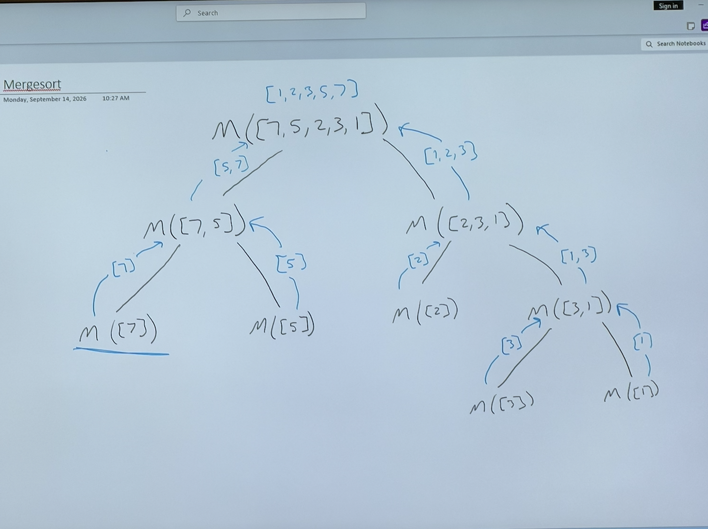
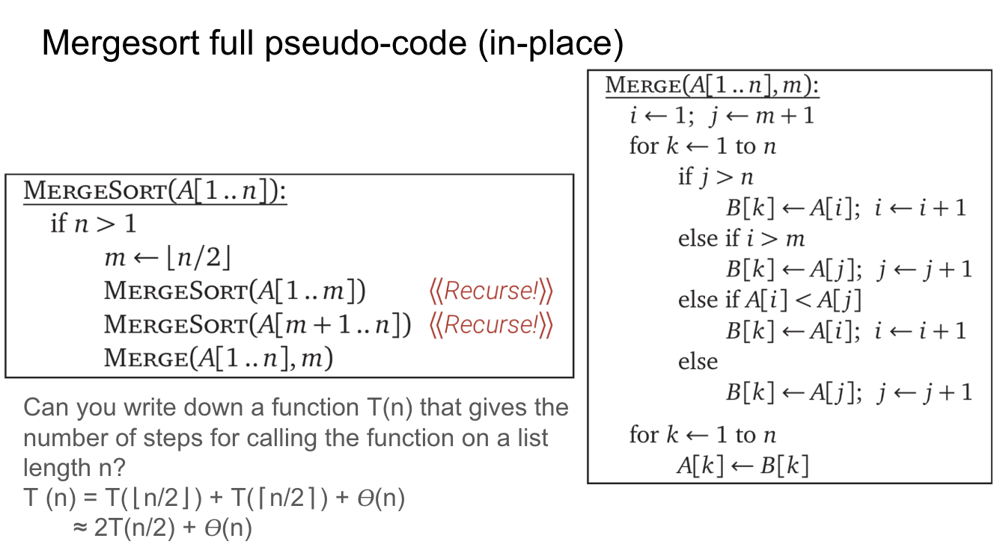

# Monday

Start:
- BS Fast Enterprises advertisement to recruit underpaid CS workers
- requires you to move everywhere with awful pay
- move them to different countries
- yawn.. 

# This week is Divide and Conquer

# Slides
[Divide and Conquer deck](https://docs.google.com/presentation/d/1u3iWDtG4JNjg6gGPmKQxefa05G8TiKw5gf84iUDkxgs/edit?slide=id.p#slide=id.p)

[How to study for Exams](https://docs.google.com/presentation/d/1Y7KRzNdWCb1-9MY1j6ubCmny547GEj8drVqqQulyA3s/edit?slide=id.p#slide=id.p)

# Google Drive
[Entire Drive](https://drive.google.com/drive/folders/1qpJodPtTNLhRk7sRJkCCOLOC-rA3zk_7)

# Recursive Merge Sort

[Good visual: visualgo recursion](https://visualgo.net/en/recursion)

# In class example

# Example 
